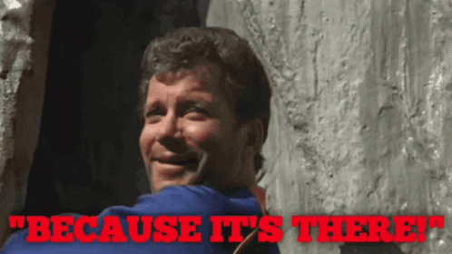

# [abhe.in](https://abhe.in)

## About

My personal website -- an attempt to build it from scratch using basic HTML, CSS and JavaScript, and manage it without using any templates, a CMS or a static site generator.

## Built Using 

* [HTML](https://en.wikipedia.org/wiki/HTML)
* [CSS](https://en.wikipedia.org/wiki/CSS)
* (basic) [JavaScript](https://en.wikipedia.org/wiki/JavaScript)
* [MDN Web Docs](https://developer.mozilla.org/en-US/docs/Learn): the basics
* [Git](https://git-scm.com/): version-control
* [GitHub Pages](https://pages.github.com/): hosting
* [Jekyll Documentation](https://jekyllrb.com/docs/): inspiring my clunky workflow

<!-- 
* Pandoc: modifying MD files into HTML
* Python: scripting Pandoc using PyPandoc-->

## Objective

Build a website to serve as:

* My resume.
* A living document that chronicles my journey into web design and coding (by virtue of being version-controlled by Git, and linking to my other [Tinkerings](https://github.com/abheshek-pandey/tinkerings)).
* A place to share my photography, ramblings and other interests.
* A portfolio of my endeavours as Ayan De in fiction writing.

## Rationale

Why would I want to limit myself to my very basic knowledge of HTML to build a website?

* To allow me to experience the beauty in the simplicity of using nothing but the basic building blocks of the *webisphere*. To return to the an unfussy place in the midst of the chaos and stress brought unto us by social media and big tech in general. To walk barefoot on grass covered in morning dew as the wind blows flour.
* Because I am stubborn and wanted to see if I could.

*It's mostly the second one.*

## Outcome

This is far from a completed project, but as I go along on this journey, I'm gaining a better understanding of web design, and coming up with solutions to solve problems that I created in the first place.

It has had me seeking answers in Python, which is something else I am trying to learn, and shown me that there isn't a limit to what programming can let you do (as long as you have access to StackExchange).

## Future Work

* Add Responsiveness
* Refining the HTML files.
* Improving accessibility.
* Adding more parameters to the CSS.
* Explore further use of JavaScript.
* Improving the "back-end" operations.
* Adding a blog.
* Posting "interesting" things on the  blog.
* Add a tagging system for the blogs.
* Adding a WebAudio player for my PureData patches.

---

